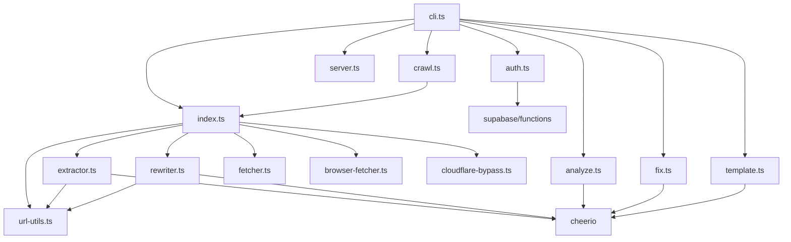

# Polaristar CLI - 项目索引

> ⚠️ **本文件是 GEB L1 索引，任何项目结构或重要文件变更后必须更新我**

## 项目概述

Polaristar CLI 是一个专业的网站资源收集工具，支持 Cloudflare 绕过、多页爬取和离线重构。

### 核心功能

| 功能 | 说明 |
|------|------|
| 资源提取 | 下载图片、CSS、JS、字体 |
| 路径重写 | 自动转换为本地路径 |
| Cloudflare 绕过 | puppeteer-real-browser + TLS 指纹伪装 |
| 网站爬取 | 多页爬取，深度/数量控制 |
| 网站分析 | 提取导航、路由、结构 |
| 链接修复 | 修复 CDN URL、字体引用 |
| 本地预览 | HTTP 服务器离线查看 |
| 模板系统 | 提取和自定义站点模板 |

## 技术栈

| 类别 | 技术 |
|------|------|
| 运行时 | Node.js ≥18 |
| 语言 | TypeScript |
| HTTP 客户端 | undici, got-scraping |
| 浏览器自动化 | puppeteer-real-browser |
| HTML 解析 | cheerio |
| CLI 框架 | commander |
| 认证系统 | Supabase |

## 项目结构

```
resource-collector/
├── src/                 # 源代码目录
│   ├── cli.ts           # CLI 入口 (commander)
│   ├── index.ts         # 主模块 (资源收集核心)
│   ├── fetcher.ts       # HTTP 请求 (undici)
│   ├── browser-fetcher.ts # 浏览器模式 (puppeteer-real-browser)
│   ├── cloudflare-bypass.ts # TLS 指纹伪装 (got-scraping)
│   ├── extractor.ts     # 资源提取 (cheerio)
│   ├── rewriter.ts      # 路径重写 (cheerio)
│   ├── url-utils.ts     # URL 工具函数
│   ├── crawl.ts         # 网站爬取
│   ├── analyze.ts       # 网站分析
│   ├── fix.ts           # 链接修复
│   ├── server.ts        # 本地 HTTP 服务器
│   ├── template.ts      # 模板提取/应用
│   └ auth.ts           # 认证/订阅管理
├── supabase/            # Supabase 配置
│   ├── schema.sql       # 数据库 Schema
│   ├── functions/       # Edge Functions
│   │   ├── verify-subscription/
│   │   ├── report-usage/
│   │   └── create-api-key/
├── docs/                # 文档目录
│   └ CLOUDFLARE_BYPASS.md
├── dist/                # 编译输出
└── package.json         # NPM 配置
```

## 模块依赖图



## 命令体系

| 命令 | 层级 | 功能 |
|------|------|------|
| `collect` (默认) | free | 单页资源收集 |
| `crawl` | pro | 多页网站爬取 |
| `analyze` | pro | 网站结构分析 |
| `fix` | pro | 链接修复 |
| `serve` | free | 本地预览 |
| `template` | pro | 模板提取/应用 |
| `login/status/logout` | free | 认证管理 |

## GEB 分形规则

**自指声明**: 本索引描述项目结构，当任何模块增删、依赖变更或架构调整时，必须同步更新本文件和对应的 `_dir.md`。

**同构性**: 代码与文档必须保持结构一致——每个模块对应一个 L3 注释块，每个目录对应一个 L2 `_dir.md`。

**奇异循环**: 通过 GEB 分形系统实现自我维护——变更触发文档更新，文档指导代码理解，形成闭环。

---

**创建日期**: 2026-04-22
**更新日期**: 2026-04-22