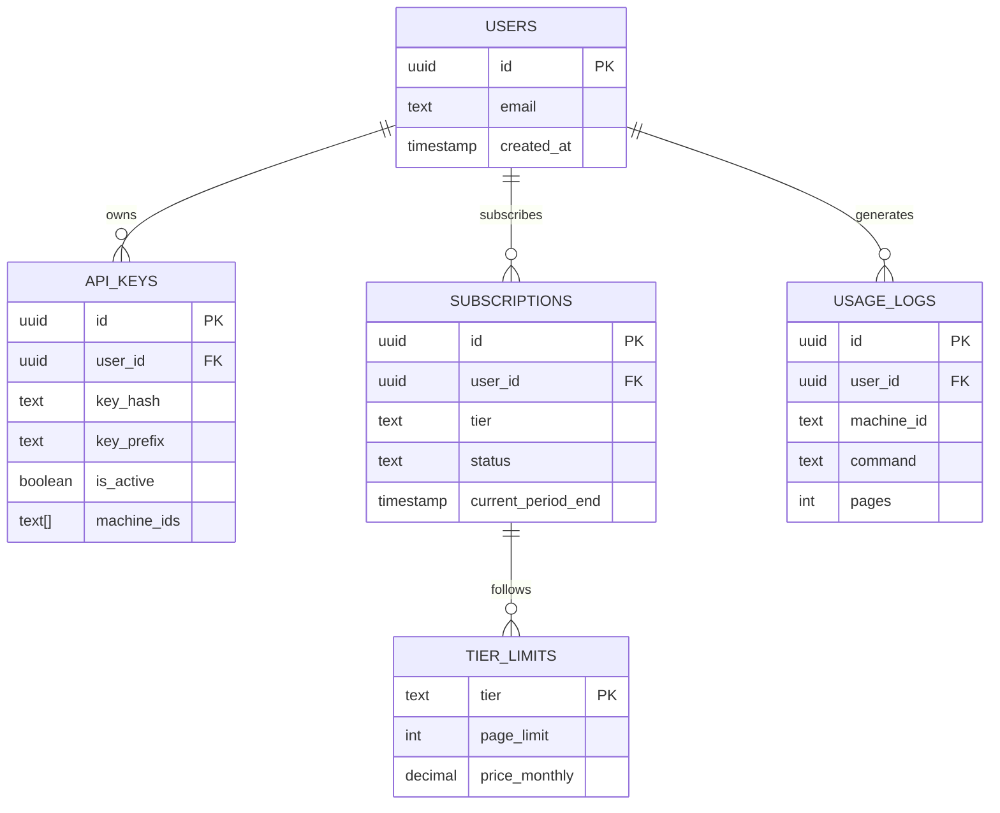

# supabase/ - Supabase 认证系统

> ⚠️ **本文件夹内容变更时必须同步更新本 _dir.md**

## 目录目的

存放 Polaristar CLI 订阅认证系统的 Supabase 配置，包括数据库 Schema 和 Edge Functions。

## 文件清单

| 文件/目录 | 职责 | 说明 |
|-----------|------|------|
| `schema.sql` | 数据库 Schema | 定义用户、订阅、API Key、用量表 |
| `DEPLOY.md` | 部署指南 | Supabase 项目配置步骤 |
| `functions/` | Edge Functions | 认证验证函数 |

## 数据库架构

## Edge Functions

| 函数 | 聯责 | 被调用方 |
|------|------|----------|
| `verify-subscription` | 验证订阅状态 | `auth.ts` |
| `report-usage` | 报告使用量 | `auth.ts` |
| `create-api-key` | 创建 API Key | 用户界面 |

## 与 CLI 的交互

`src/auth.ts` 通过以下方式与 Supabase 交互：
- POST `/functions/v1/verify-subscription` → 验证订阅
- POST `/functions/v1/report-usage` → 报告使用量

## GEB 自指规则

当修改 Schema 或新增 Edge Function 时：
1. 更新本文件架构图
2. 更新 PROJECT_INDEX.md 结构
3. 更新 `src/auth.ts` L3 注释

---

**创建日期**: 2026-04-22